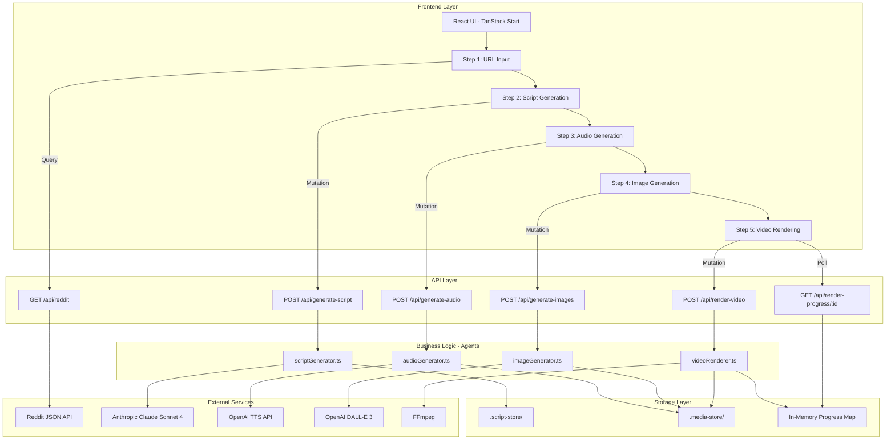
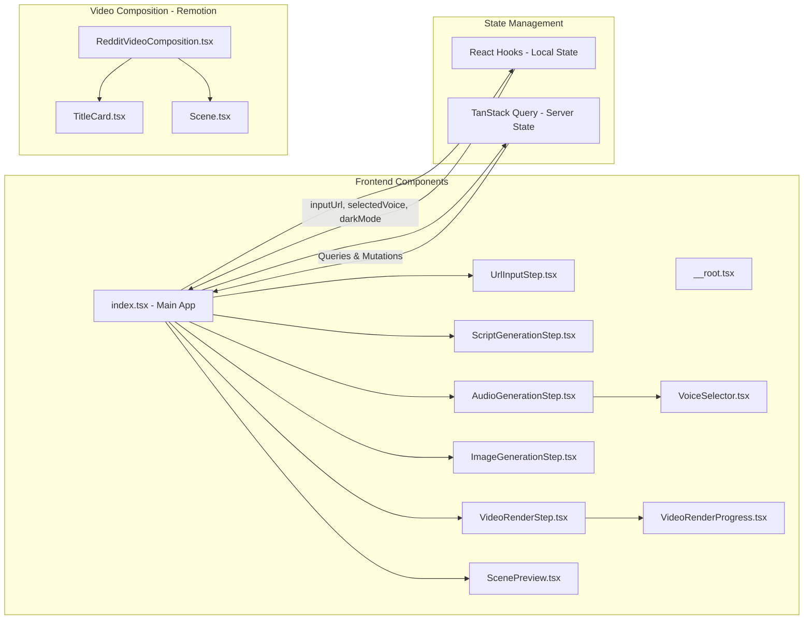
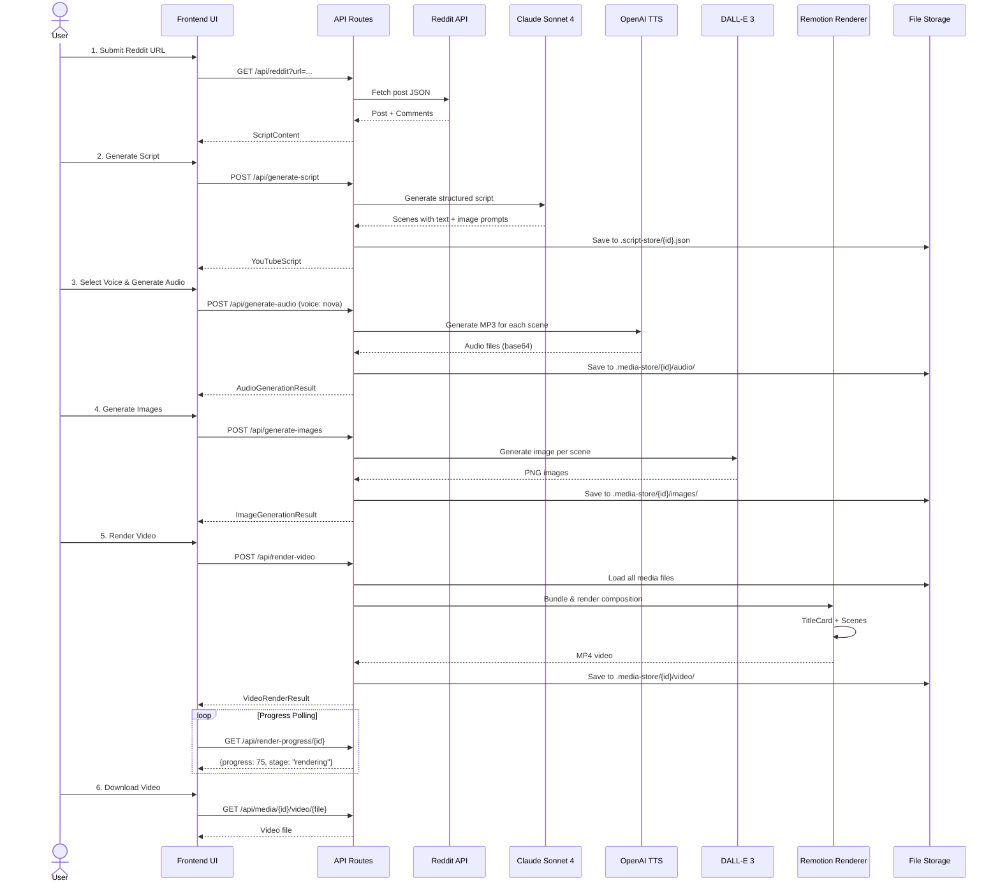
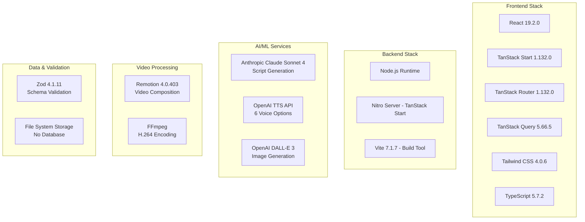
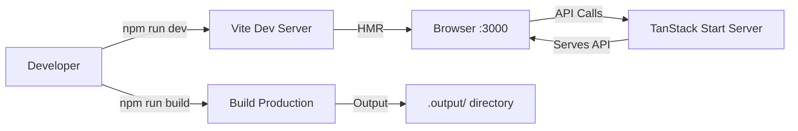

# red2video - Architecture Diagram

## System Overview

red2video is a full-stack web application that converts Reddit posts into engaging short-form videos using AI. It orchestrates a multi-step pipeline: Reddit extraction → Script generation → Audio synthesis → Image generation → Video rendering.

---

## High-Level Architecture



---

## Detailed Component Architecture



---

## Data Flow Pipeline



---

## Technology Stack



---

## File Storage Structure

```
red2video/
├── .script-store/
│   └── {scriptId}.json              # Script metadata + generation status
│
├── .media-store/
│   └── {scriptId}/
│       ├── images/
│       │   ├── scene-0.png          # DALL-E generated images
│       │   ├── scene-1.png
│       │   └── ...
│       │
│       ├── audio/
│       │   ├── scene-0.mp3          # OpenAI TTS audio files
│       │   ├── scene-1.mp3
│       │   └── ...
│       │
│       └── video/
│           └── {scriptId}.mp4       # Final rendered video
│
└── .temp-audio/
    └── {temp-files}.mp3             # Temporary audio for duration calculation
```

---

## Key Architectural Patterns

### 1. **Multi-Step Wizard Pattern**
- Five sequential steps with state preservation
- Each step enables next step on success
- Progress visualization for user feedback

### 2. **Agent-Based Architecture**
- Separate agents for distinct AI tasks
- Each agent handles one external service
- Clean separation of concerns

### 3. **File-Based Persistence**
- Simple file system storage (no database)
- JSON for metadata, binary for media
- Organized by script ID

### 4. **Polling-Based Progress**
- In-memory progress tracking
- Frontend polls every 500ms
- Simple alternative to WebSockets

### 5. **Structured AI Output**
- Zod schemas enforce AI response format
- Type-safe script generation
- Predictable data structures

### 6. **Base64 Data URL Strategy**
- Media files converted to data URLs for Remotion
- Avoids file path complexity in rendering
- Simplifies bundling process

---

## API Endpoints Reference

| Endpoint | Method | Purpose | Agent |
|----------|--------|---------|-------|
| `/api/reddit` | GET | Extract Reddit post + comments | - |
| `/api/generate-script` | POST | Generate video script from post | scriptGenerator |
| `/api/generate-audio` | POST | Generate TTS for all scenes | audioGenerator |
| `/api/generate-images` | POST | Generate images for all scenes | imageGenerator |
| `/api/render-video` | POST | Render final MP4 video | videoRenderer |
| `/api/render-progress/:scriptId` | GET | Poll rendering progress | - |
| `/api/media/:scriptId/images/:fileName` | GET | Serve generated images | - |
| `/api/media/:scriptId/video/:fileName` | GET | Serve rendered video | - |

---

## Environment Variables

```bash
ANTHROPIC_API_KEY=<your-key>     # Claude Sonnet 4 API
OPENAI_API_KEY=<your-key>        # OpenAI TTS + DALL-E 3
```

---

## Video Composition Structure (Remotion)

```
RedditVideoComposition (1920x1080, 30fps)
│
├── TitleCard
│   ├── Duration: 4 seconds (120 frames)
│   └── Content: "Reddit Story" title text
│
└── Scenes (dynamic sequence)
    └── For each scene:
        ├── Background: DALL-E generated image
        ├── Audio: OpenAI TTS voiceover
        ├── Duration: Based on actual audio length
        └── Transitions: Fade effects
```

---

## Development Workflow



---

## Security Considerations

- **API Keys**: Stored in environment variables (never committed)
- **Public Reddit Access**: No authentication required (public posts only)
- **File Upload**: No user file uploads (only URLs)
- **Rate Limiting**: Consider for production (not implemented in MVP)
- **Input Validation**: Zod schemas validate all API inputs

---

## Performance Optimizations

1. **React Query Caching**: Server state cached automatically
2. **Conditional Rendering**: Steps only render when data available
3. **Parallel Processing**: Multiple TanStack Query requests in parallel
4. **Base64 Caching**: Media converted once, reused in rendering
5. **Remotion Bundling**: Webpack bundling optimized for video assets

---

## Future Architecture Enhancements

- **Database Integration**: PostgreSQL for script metadata (scalability)
- **Cloud Storage**: S3/R2 for media files (scalability)
- **WebSocket Progress**: Real-time updates instead of polling
- **Queue System**: Background job processing for video rendering
- **CDN Integration**: Serve static assets via CDN
- **Authentication**: User accounts and project management
- **Caching Layer**: Redis for frequently accessed data
