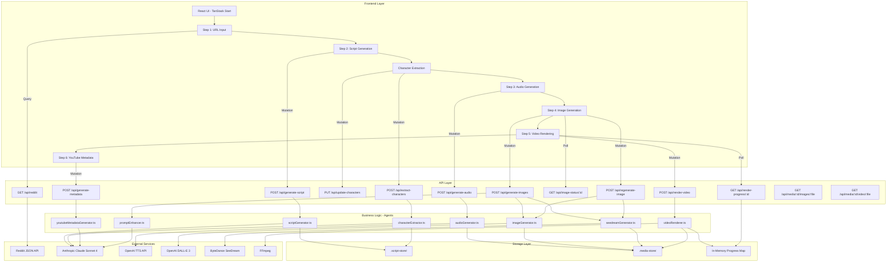
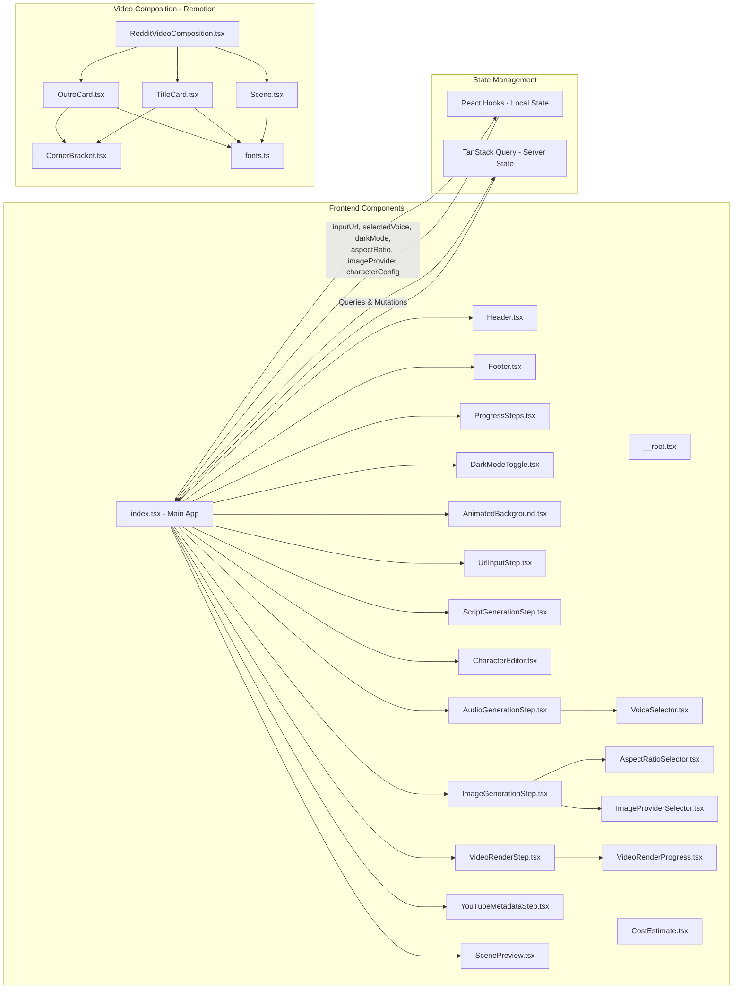
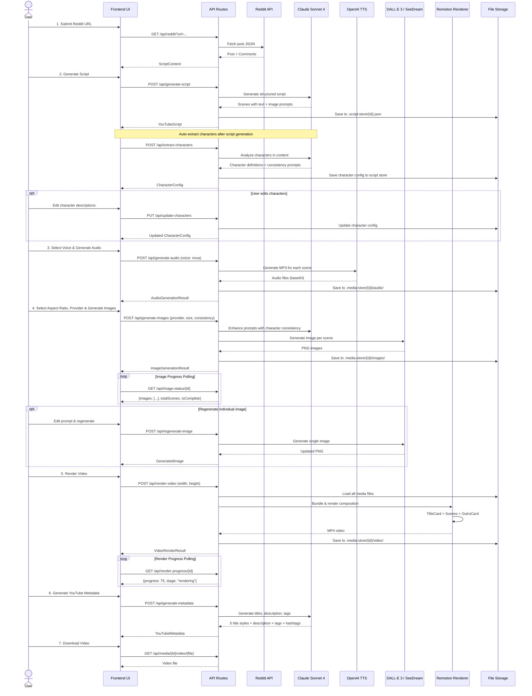
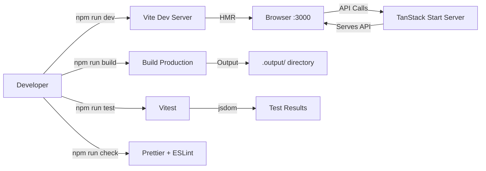

# red2video - Architecture Diagram

## System Overview

red2video is a full-stack web application that converts Reddit posts into engaging short-form videos using AI. It orchestrates a multi-step pipeline: Reddit extraction → Script generation → Character extraction → Audio synthesis → Image generation → Video rendering → YouTube metadata generation.

---

## High-Level Architecture


```mermaid
graph TB
    subgraph "Frontend Layer"
        UI[React UI - TanStack Start]
        Step1[Step 1: URL Input]
        Step2[Step 2: Script Generation]
        StepChar[Character Extraction]
        Step3[Step 3: Audio Generation]
        Step4[Step 4: Image Generation]
        Step5[Step 5: Video Rendering]
        Step6[Step 6: YouTube Metadata]

        UI --> Step1
        Step1 --> Step2
        Step2 --> StepChar
        StepChar --> Step3
        Step3 --> Step4
        Step4 --> Step5
        Step5 --> Step6
    end

    subgraph "API Layer"
        API1[GET /api/reddit]
        API2[POST /api/generate-script]
        API_CHAR1[POST /api/extract-characters]
        API_CHAR2[PUT /api/update-characters]
        API3[POST /api/generate-audio]
        API4[POST /api/generate-images]
        API4b[POST /api/regenerate-image]
        API4c[GET /api/image-status/:id]
        API5[POST /api/render-video]
        API6[GET /api/render-progress/:id]
        API7[POST /api/generate-metadata]
        API_MEDIA1[GET /api/media/:id/images/:file]
        API_MEDIA2[GET /api/media/:id/video/:file]
    end

    subgraph "Business Logic - Agents"
        Agent1[scriptGenerator.ts]
        Agent2[audioGenerator.ts]
        Agent3[imageGenerator.ts]
        Agent3b[seedreamGenerator.ts]
        Agent3c[promptEnhancer.ts]
        Agent4[videoRenderer.ts]
        Agent5[characterExtractor.ts]
        Agent6[youtubeMetadataGenerator.ts]
    end

    subgraph "External Services"
        Reddit[Reddit JSON API]
        Claude[Anthropic Claude Sonnet 4]
        TTS[OpenAI TTS API]
        DALLE[OpenAI DALL-E 3]
        SeeDream[ByteDance SeeDream]
        FFmpeg[FFmpeg]
    end

    subgraph "Storage Layer"
        ScriptStore[.script-store/]
        MediaStore[.media-store/]
        Progress[In-Memory Progress Map]
    end

    Step1 -->|Query| API1
    Step2 -->|Mutation| API2
    StepChar -->|Mutation| API_CHAR1
    StepChar -->|Mutation| API_CHAR2
    Step3 -->|Mutation| API3
    Step4 -->|Mutation| API4
    Step4 -->|Mutation| API4b
    Step4 -->|Poll| API4c
    Step5 -->|Mutation| API5
    Step5 -->|Poll| API6
    Step6 -->|Mutation| API7

    API1 --> Reddit
    API2 --> Agent1
    API_CHAR1 --> Agent5
    API3 --> Agent2
    API4 --> Agent3
    API4 --> Agent3b
    API4 --> Agent3c
    API4b --> Agent3
    API4b --> Agent3b
    API5 --> Agent4
    API7 --> Agent6

    Agent1 --> Claude
    Agent5 --> Claude
    Agent6 --> Claude
    Agent3c --> Claude
    Agent2 --> TTS
    Agent3 --> DALLE
    Agent3b --> SeeDream
    Agent4 --> FFmpeg

    Agent1 --> ScriptStore
    Agent5 --> ScriptStore
    Agent2 --> MediaStore
    Agent3 --> MediaStore
    Agent3b --> MediaStore
    Agent4 --> MediaStore
    Agent4 --> Progress
    API6 --> Progress
```

---

## Detailed Component Architecture


```mermaid
graph LR
    subgraph "Frontend Components"
        direction TB
        Root[__root.tsx]
        Index[index.tsx - Main App]

        Header[Header.tsx]
        Footer[Footer.tsx]
        ProgressSteps[ProgressSteps.tsx]
        DarkMode[DarkModeToggle.tsx]
        AnimBg[AnimatedBackground.tsx]

        UrlInput[UrlInputStep.tsx]
        ScriptGen[ScriptGenerationStep.tsx]
        CharEdit[CharacterEditor.tsx]
        AudioGen[AudioGenerationStep.tsx]
        ImageGen[ImageGenerationStep.tsx]
        VideoRender[VideoRenderStep.tsx]
        MetadataGen[YouTubeMetadataStep.tsx]

        VoiceSelect[VoiceSelector.tsx]
        AspectSelect[AspectRatioSelector.tsx]
        ImgProvider[ImageProviderSelector.tsx]
        Progress[VideoRenderProgress.tsx]
        Preview[ScenePreview.tsx]
        CostEst[CostEstimate.tsx]

        Index --> Header
        Index --> Footer
        Index --> ProgressSteps
        Index --> DarkMode
        Index --> AnimBg
        Index --> UrlInput
        Index --> ScriptGen
        Index --> CharEdit
        Index --> AudioGen
        Index --> ImageGen
        Index --> VideoRender
        Index --> MetadataGen
        Index --> Preview

        AudioGen --> VoiceSelect
        ImageGen --> AspectSelect
        ImageGen --> ImgProvider
        VideoRender --> Progress
    end

    subgraph "State Management"
        LocalState[React Hooks - Local State]
        ServerState[TanStack Query - Server State]

        LocalState -->|inputUrl, selectedVoice, darkMode,<br/>aspectRatio, imageProvider,<br/>characterConfig| Index
        ServerState -->|Queries & Mutations| Index
    end

    subgraph "Video Composition - Remotion"
        RedditVideo[RedditVideoComposition.tsx]
        TitleCard[TitleCard.tsx]
        Scene[Scene.tsx]
        OutroCard[OutroCard.tsx]
        CornerBracket[CornerBracket.tsx]
        Fonts[fonts.ts]

        RedditVideo --> TitleCard
        RedditVideo --> Scene
        RedditVideo --> OutroCard
        TitleCard --> CornerBracket
        OutroCard --> CornerBracket
        Scene --> Fonts
        TitleCard --> Fonts
        OutroCard --> Fonts
    end

    Index --> LocalState
    Index --> ServerState
```

---

## Data Flow Pipeline


```mermaid
sequenceDiagram
    actor User
    participant UI as Frontend UI
    participant API as API Routes
    participant Reddit as Reddit API
    participant Claude as Claude Sonnet 4
    participant TTS as OpenAI TTS
    participant ImgGen as DALL-E 3 / SeeDream
    participant Remotion as Remotion Renderer
    participant Store as File Storage

    User->>UI: 1. Submit Reddit URL
    UI->>API: GET /api/reddit?url=...
    API->>Reddit: Fetch post JSON
    Reddit-->>API: Post + Comments
    API-->>UI: ScriptContent

    User->>UI: 2. Generate Script
    UI->>API: POST /api/generate-script
    API->>Claude: Generate structured script
    Claude-->>API: Scenes with text + image prompts
    API->>Store: Save to .script-store/{id}.json
    API-->>UI: YouTubeScript

    Note over UI,Claude: Auto-extract characters after script generation

    UI->>API: POST /api/extract-characters
    API->>Claude: Analyze characters in content
    Claude-->>API: Character definitions + consistency prompts
    API->>Store: Save character config to script store
    API-->>UI: CharacterConfig

    opt User edits characters
        User->>UI: Edit character descriptions
        UI->>API: PUT /api/update-characters
        API->>Store: Update character config
        API-->>UI: Updated CharacterConfig
    end

    User->>UI: 3. Select Voice & Generate Audio
    UI->>API: POST /api/generate-audio (voice: nova)
    API->>TTS: Generate MP3 for each scene
    TTS-->>API: Audio files (base64)
    API->>Store: Save to .media-store/{id}/audio/
    API-->>UI: AudioGenerationResult

    User->>UI: 4. Select Aspect Ratio, Provider & Generate Images
    UI->>API: POST /api/generate-images (provider, size, consistency)
    API->>Claude: Enhance prompts with character consistency
    API->>ImgGen: Generate image per scene
    ImgGen-->>API: PNG images
    API->>Store: Save to .media-store/{id}/images/
    API-->>UI: ImageGenerationResult

    loop Image Progress Polling
        UI->>API: GET /api/image-status/{id}
        API-->>UI: {images: [...], totalScenes, isComplete}
    end

    opt Regenerate individual image
        User->>UI: Edit prompt & regenerate
        UI->>API: POST /api/regenerate-image
        API->>ImgGen: Generate single image
        ImgGen-->>API: Updated PNG
        API-->>UI: GeneratedImage
    end

    User->>UI: 5. Render Video
    UI->>API: POST /api/render-video (width, height)
    API->>Store: Load all media files
    API->>Remotion: Bundle & render composition
    Remotion->>Remotion: TitleCard + Scenes + OutroCard
    Remotion-->>API: MP4 video
    API->>Store: Save to .media-store/{id}/video/
    API-->>UI: VideoRenderResult

    loop Render Progress Polling
        UI->>API: GET /api/render-progress/{id}
        API-->>UI: {progress: 75, stage: "rendering"}
    end

    User->>UI: 6. Generate YouTube Metadata
    UI->>API: POST /api/generate-metadata
    API->>Claude: Generate titles, description, tags
    Claude-->>API: 5 title styles + description + tags + hashtags
    API-->>UI: YouTubeMetadata

    User->>UI: 7. Download Video
    UI->>API: GET /api/media/{id}/video/{file}
    API-->>UI: Video file
```

---

## Technology Stack

```mermaid
graph TB
    subgraph "Frontend Stack"
        React[React 19.2.0]
        TanStackStart[TanStack Start 1.132.0]
        TanStackRouter[TanStack Router 1.132.0]
        TanStackQuery[TanStack Query 5.66.5]
        Tailwind[Tailwind CSS 4.0.6]
        ShadcnUI[Shadcn UI - New York Style]
        Lucide[Lucide React - Icons]
        TypeScript[TypeScript 5.7.2]
    end

    subgraph "Backend Stack"
        Node[Node.js Runtime]
        Nitro[Nitro Server - TanStack Start]
        Vite[Vite 7.1.7 - Build Tool]
        VercelAI[Vercel AI SDK 6.0.23]
    end

    subgraph "AI/ML Services"
        Claude[Anthropic Claude Sonnet 4<br/>Script + Characters + Metadata + Prompts]
        OpenAI_TTS[OpenAI TTS API<br/>6 Voice Options]
        OpenAI_DALLE[OpenAI DALL-E 3<br/>Image Generation]
        ByteDance[ByteDance SeeDream<br/>Alternative Image Provider]
    end

    subgraph "Video Processing"
        Remotion[Remotion 4.0.403<br/>Video Composition]
        RemotionTransitions[Remotion Transitions<br/>Fade Effects]
        RemotionFonts[Remotion Google Fonts<br/>Playfair Display + IBM Plex Mono]
        FFmpeg_Tool[FFmpeg<br/>H.264 Encoding]
    end

    subgraph "Data & Validation"
        Zod[Zod 4.1.11<br/>Schema Validation]
        T3Env[@t3-oss/env-core<br/>Environment Validation]
        FileSystem[File System Storage<br/>No Database]
    end

    subgraph "Testing"
        Vitest[Vitest 3.0.5]
        TestingLib[Testing Library - React + DOM]
        JSDOM[jsdom 27.0.0]
    end
```

---

## File Storage Structure

```
red2video/
├── .script-store/
│   └── {scriptId}.json              # Script metadata + character config + generation status
│
├── .media-store/
│   └── {scriptId}/
│       ├── images/
│       │   ├── scene-0.png          # DALL-E / SeeDream generated images
│       │   ├── scene-1.png
│       │   └── ...
│       │
│       ├── audio/
│       │   ├── scene-0.mp3          # OpenAI TTS audio files
│       │   ├── scene-1.mp3
│       │   └── ...
│       │
│       └── video/
│           └── {scriptId}.mp4       # Final rendered video
│
├── .temp-audio/
│   └── {temp-files}.mp3             # Temporary audio for duration calculation
│
└── .cta.json                        # Outro card CTA configuration (channel name, social handle)
```

---

## Key Architectural Patterns

### 1. **Multi-Step Wizard Pattern**

- Six sequential steps with state preservation
- Each step enables the next step on success
- Progress visualization via `ProgressSteps` component
- Character extraction auto-triggers after script generation

### 2. **Agent-Based Architecture**

- Eight separate agents for distinct AI tasks:
  - `scriptGenerator` — Claude-powered script creation
  - `characterExtractor` — Character consistency extraction
  - `promptEnhancer` — Character-aware prompt enhancement
  - `audioGenerator` — OpenAI TTS synthesis
  - `imageGenerator` — DALL-E 3 image creation
  - `seedreamGenerator` — ByteDance SeeDream alternative
  - `videoRenderer` — Remotion video rendering
  - `youtubeMetadataGenerator` — YouTube SEO metadata
- Each agent handles one external service
- Clean separation of concerns

### 3. **Character Consistency System**

- AI extracts character definitions from source content
- Physical descriptions stored per character (age, build, hair, clothing, etc.)
- Consistency prompts injected into image generation
- Users can edit character descriptions before generating images
- Supports character roles (protagonist, antagonist, supporting, background)
- Supports character types (human, animal, creature, object)

### 4. **Multi-Provider Image Generation**

- Pluggable image provider architecture
- DALL-E 3 (OpenAI) — primary provider
- SeeDream (ByteDance via ARK API) — alternative provider
- Per-scene image regeneration with custom prompts
- Progress polling during generation (every 2 seconds)

### 5. **Aspect Ratio Support**

- Three video formats supported:
  - **16:9** (1920x1080) — YouTube, Desktop
  - **9:16** (1080x1920) — TikTok, Reels, Shorts
  - **1:1** (1080x1080) — Instagram, Facebook
- Image sizes adapt to match: 1792x1024, 1024x1792, 1024x1024

### 6. **File-Based Persistence**
- Simple file system storage (no database)
- JSON for metadata + character configs, binary for media
- Organized by script ID

### 7. **Polling-Based Progress**
- In-memory progress tracking for video rendering
- Image status polling during generation (every 2 seconds)
- Video render polling (every 500ms)

### 8. **Structured AI Output**
- Zod schemas enforce AI response format
- Type-safe script generation and metadata
- Predictable data structures throughout

### 9. **Base64 Data URL Strategy**
- Media files converted to data URLs for Remotion
- Avoids file path complexity in rendering
- Simplifies bundling process

---

## API Endpoints Reference

| Endpoint | Method | Purpose | Agent |
|----------|--------|---------|-------|
| `/api/reddit` | GET | Extract Reddit post + comments | - |
| `/api/generate-script` | POST | Generate video script from post | scriptGenerator |
| `/api/extract-characters` | POST | Extract character definitions from content | characterExtractor |
| `/api/update-characters` | PUT | Update character descriptions/config | - |
| `/api/generate-audio` | POST | Generate TTS for all scenes | audioGenerator |
| `/api/generate-images` | POST | Generate images for all scenes | imageGenerator / seedreamGenerator |
| `/api/regenerate-image` | POST | Regenerate a single scene image | imageGenerator / seedreamGenerator |
| `/api/image-status/:scriptId` | GET | Poll image generation progress | - |
| `/api/render-video` | POST | Render final MP4 video | videoRenderer |
| `/api/render-progress/:scriptId` | GET | Poll rendering progress | - |
| `/api/generate-metadata` | POST | Generate YouTube titles, description, tags | youtubeMetadataGenerator |
| `/api/media/:scriptId/images/:fileName` | GET | Serve generated images | - |
| `/api/media/:scriptId/video/:fileName` | GET | Serve rendered video | - |

---

## Environment Variables

```bash
ANTHROPIC_API_KEY=<your-key>     # Claude Sonnet 4 API (scripts, characters, metadata, prompts)
OPENAI_API_KEY=<your-key>        # OpenAI TTS + DALL-E 3
ARK_API_KEY=<your-key>           # ByteDance ARK API (SeeDream image generation)
```

---

## Video Composition Structure (Remotion)

```
RedditVideoComposition (dynamic resolution, 30fps)
│
├── TitleCard
│   ├── Duration: 4 seconds (120 frames)
│   ├── Content: Story title + "Reddit Story" subtitle
│   ├── Animations: Spring entrance, fade in/out, rotating decorative rings
│   ├── Fonts: Playfair Display (title), IBM Plex Mono (subtitle)
│   └── Decorations: Animated corner brackets
│
├── Scenes (dynamic TransitionSeries)
│   └── For each scene:
│       ├── Background: AI-generated image (Ken Burns zoom effect)
│       ├── Audio: OpenAI TTS voiceover (volume fade in/out)
│       ├── Text: Bottom overlay with gradient backdrop
│       ├── Duration: Based on actual audio length
│       ├── Transitions: Fade effects (15 frames between scenes)
│       ├── CTA overlay on last scene (if no outro): "Like • Comment • Subscribe"
│       └── Animations: Spring text entrance, smooth opacity transitions
│
└── OutroCard (optional, enabled by default)
    ├── Duration: 5 seconds (150 frames)
    ├── Content: "Thanks for watching!" + Subscribe button + channel info
    ├── Animations: Staggered springs, button pulse, bell shake
    ├── Configurable: Channel name + social handle via .cta.json
    └── Decorations: Animated corner brackets, rotating rings

Transition overlaps are subtracted from total duration.
Supported resolutions: 1920x1080 (16:9), 1080x1920 (9:16), 1080x1080 (1:1)
```

---

## Source Directory Structure

```
src/
├── agents/                          # Business logic agents
│   ├── scriptGenerator.ts           # Claude script generation
│   ├── characterExtractor.ts        # Character consistency extraction
│   ├── promptEnhancer.ts            # Character-aware prompt enhancement
│   ├── audioGenerator.ts            # OpenAI TTS integration
│   ├── imageGenerator.ts            # DALL-E 3 image generation
│   ├── seedreamGenerator.ts         # ByteDance SeeDream integration
│   ├── videoRenderer.ts             # Remotion video rendering
│   └── youtubeMetadataGenerator.ts  # YouTube metadata generation
│
├── components/                      # React UI components
│   ├── AnimatedBackground.tsx       # Floating particle background
│   ├── AspectRatioSelector.tsx      # 16:9 / 9:16 / 1:1 picker
│   ├── AudioGenerationStep.tsx      # Step 3: voice selection + audio gen
│   ├── CharacterEditor.tsx          # Character consistency editor
│   ├── CostEstimate.tsx             # Estimated API cost display
│   ├── DarkModeToggle.tsx           # Dark/light mode toggle
│   ├── Footer.tsx                   # Page footer
│   ├── Header.tsx                   # Page header with branding
│   ├── ImageGenerationStep.tsx      # Step 4: provider, ratio, generation
│   ├── ImageProviderSelector.tsx    # DALL-E / SeeDream picker
│   ├── ProgressSteps.tsx            # Step indicator bar (6 steps)
│   ├── ScenePreview.tsx             # Scene cards with image/audio preview
│   ├── ScriptGenerationStep.tsx     # Step 2: script gen + editing
│   ├── Skeleton.tsx                 # Loading skeleton component
│   ├── StepIndicator.tsx            # Individual step indicator
│   ├── UrlInputStep.tsx             # Step 1: Reddit URL input
│   ├── VideoRenderProgress.tsx      # Render progress bar
│   ├── VideoRenderStep.tsx          # Step 5: video rendering
│   ├── VoiceSelector.tsx            # Voice picker with audio preview
│   ├── YouTubeMetadataStep.tsx      # Step 6: metadata generation
│   ├── api.ts                       # Frontend API client functions
│   ├── api.test.ts                  # API client tests
│   ├── constants.ts                 # Voice list, sample text
│   ├── index.ts                     # Barrel exports
│   └── types.ts                     # TypeScript types + configs
│
├── integrations/
│   └── tanstack-query/
│       ├── devtools.tsx             # React Query devtools
│       └── root-provider.tsx        # Query client provider
│
├── lib/                             # Utility libraries
│   ├── scriptStore.ts               # File-based script/character storage
│   ├── scriptStore.test.ts          # Script store tests
│   └── utils.ts                     # General utilities (cn, etc.)
│
├── routes/                          # TanStack Router file-based routes
│   ├── __root.tsx                   # Root layout
│   ├── index.tsx                    # Main app page
│   ├── api.reddit.ts                # GET /api/reddit
│   ├── api.generate-script.ts       # POST /api/generate-script
│   ├── api.extract-characters.ts    # POST /api/extract-characters
│   ├── api.update-characters.ts     # PUT /api/update-characters
│   ├── api.generate-audio.ts        # POST /api/generate-audio
│   ├── api.generate-images.ts       # POST /api/generate-images
│   ├── api.regenerate-image.ts      # POST /api/regenerate-image
│   ├── api.image-status.$scriptId.ts    # GET /api/image-status/:scriptId
│   ├── api.render-video.ts          # POST /api/render-video
│   ├── api.render-progress.$scriptId.ts # GET /api/render-progress/:scriptId
│   ├── api.generate-metadata.ts     # POST /api/generate-metadata
│   ├── api.media.$scriptId.images.$fileName.ts  # GET image files
│   └── api.media.$scriptId.video.$fileName.ts   # GET video files
│
├── test/
│   └── setup.ts                     # Vitest setup
│
├── utils/
│   ├── audioDuration.ts             # Audio duration calculation
│   └── audioDuration.test.ts        # Audio duration tests
│
├── video/                           # Remotion video composition
│   ├── RedditVideoComposition.tsx   # Main composition with TransitionSeries
│   ├── TitleCard.tsx                # Opening title card (4s)
│   ├── Scene.tsx                    # Individual scene with image + audio
│   ├── OutroCard.tsx                # Closing card with CTA (5s)
│   ├── CornerBracket.tsx            # Decorative corner bracket SVG
│   ├── fonts.ts                     # Playfair Display + IBM Plex Mono
│   ├── types.ts                     # Video type definitions
│   └── index.ts                     # Video exports
│
├── env.ts                           # Environment variable validation
├── router.tsx                       # Router configuration
├── routeTree.gen.ts                 # Generated route tree
├── logo.svg                         # App logo
└── styles.css                       # Global styles + Tailwind
```

---

## Development Workflow


```mermaid
graph LR
    Dev[Developer] -->|npm run dev| Vite[Vite Dev Server]
    Vite -->|HMR| Browser[Browser :3000]
    Browser -->|API Calls| TanStack[TanStack Start Server]
    TanStack -->|Serves API| Browser

    Dev -->|npm run build| Build[Build Production]
    Build -->|Output| Dist[.output/ directory]

    Dev -->|npm run test| Test[Vitest]
    Test -->|jsdom| Results[Test Results]

    Dev -->|npm run check| Lint[Prettier + ESLint]
```

---

## Security Considerations

- **API Keys**: Stored in environment variables (never committed)
- **Public Reddit Access**: No authentication required (public posts only)
- **File Upload**: No user file uploads (only URLs)
- **Rate Limiting**: Consider for production (not implemented in MVP)
- **Input Validation**: Zod schemas validate all API inputs
- **Environment Validation**: @t3-oss/env-core validates env vars at startup

---

## Performance Optimizations

1. **React Query Caching**: Server state cached automatically
2. **Conditional Rendering**: Steps only render when data available
3. **Parallel Processing**: Multiple TanStack Query requests in parallel
4. **Base64 Caching**: Media converted once, reused in rendering
5. **Remotion Bundling**: Webpack bundling optimized for video assets
6. **Image Progress Polling**: Real-time feedback during slow image generation
7. **Audio Volume Transitions**: Smooth fade in/out to avoid audio pops
8. **Spring Animations**: Physics-based animations in video for natural motion
9. **Nitro Dev Proxy**: 5-minute timeout for long-running API calls

---

## Future Architecture Enhancements

- **Database Integration**: PostgreSQL for script metadata (scalability)
- **Cloud Storage**: S3/R2 for media files (scalability)
- **WebSocket Progress**: Real-time updates instead of polling
- **Queue System**: Background job processing for video rendering
- **CDN Integration**: Serve static assets via CDN
- **Authentication**: User accounts and project management
- **Caching Layer**: Redis for frequently accessed data
